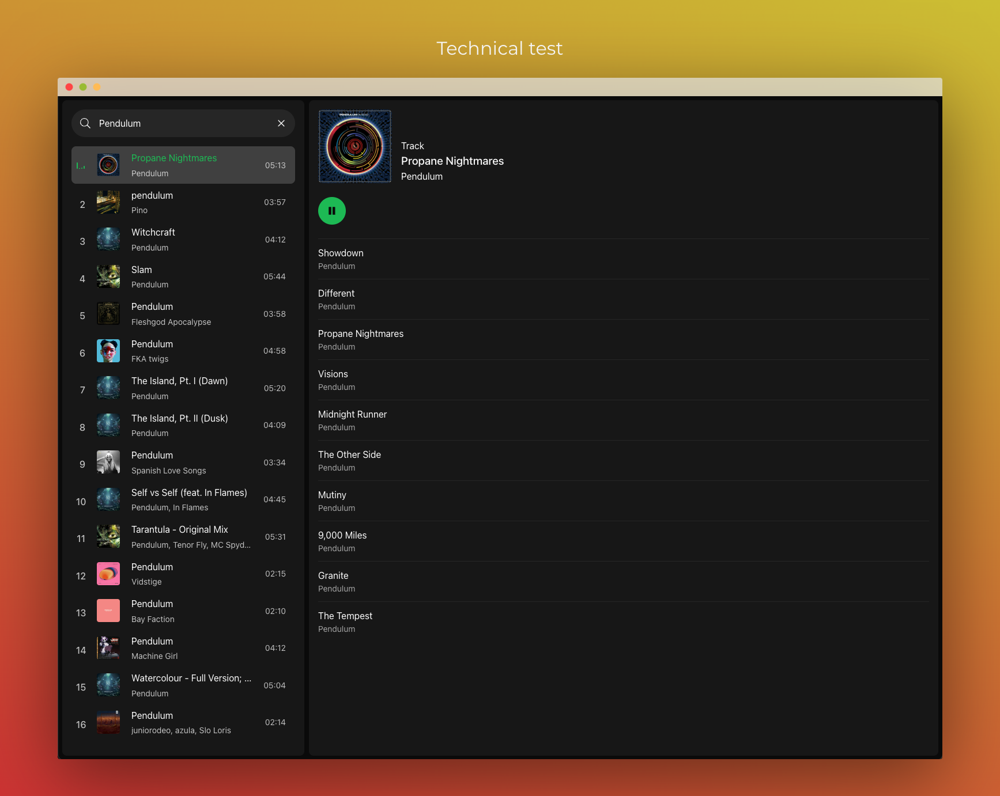

# Chronicle | Technical test

> [!NOTE]
> I thought I'd give XState a go, it's pretty fun. Please don't laugh at it, as I know it's a bit shit but I thought there's not a lot of point going deep into a domain for a technical test :P

### Supported browsers

The application should:tm: work in all greenfield browsers.

### Supported features

All required features.

### Requirements

2. [PNPM](https://pnpm.io/)

### Setup Project

1. If you have [Node Version Manager](https://github.com/nvm-sh/nvm) installed run `nvm use` otherwise ensure your terminal is on `node 20`.
2. Run `pnpm install`
3. Copy the `.env.example` to `.env` and enter the required keys.

### Run project locally

1. Run `pnpm run build`
2. Run `pnpm run preview`

### Deploy the application

If you would like to deploy this application, you can choose the method that best suits you in the [Vite documentation](https://vitejs.dev/guide/static-deploy#deploying-a-static-site).

### TODO

1. Discuss with Chris the best way to handle event listeners in XState e.g how to update the state when the audio finishes.
